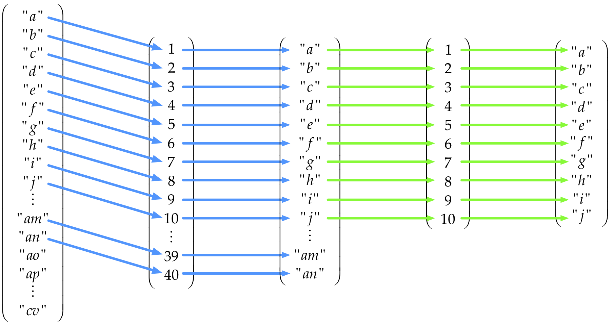
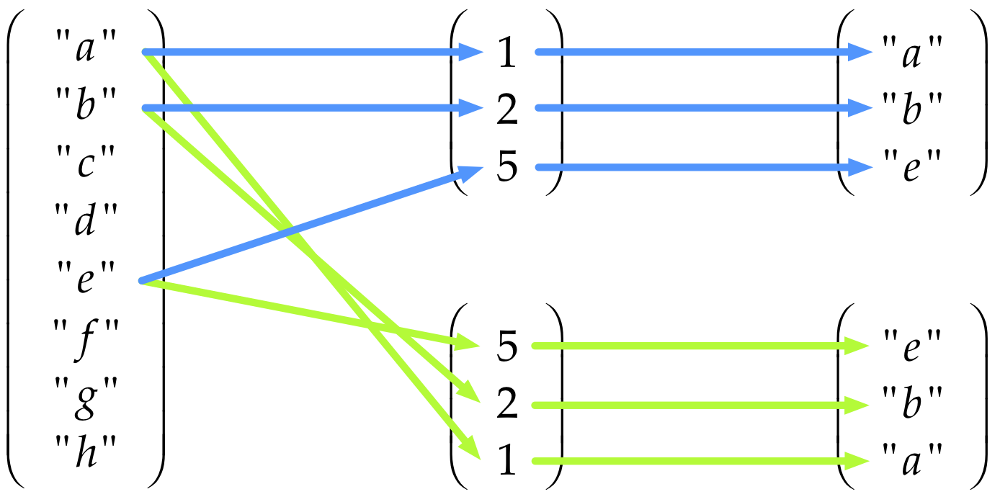
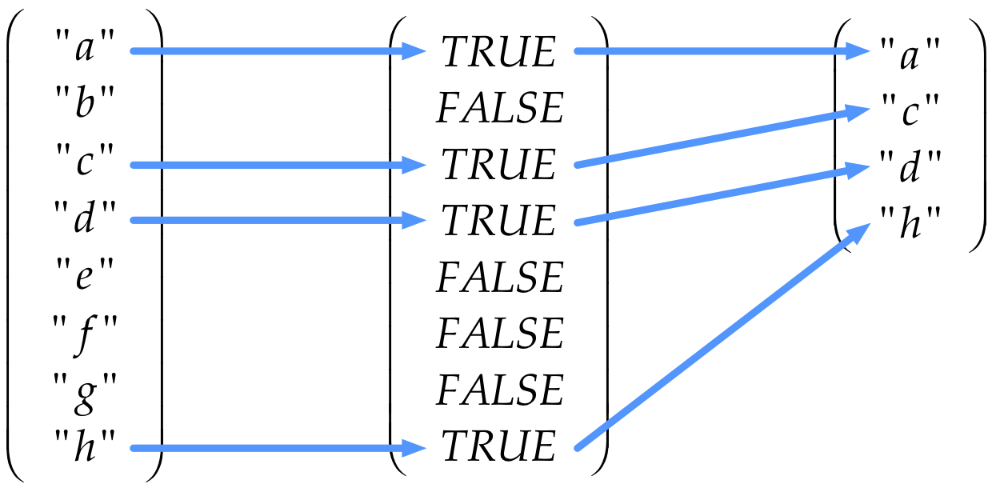

```{r setup, include=FALSE}
library(learnr)
knitr::opts_chunk$set(echo = FALSE)
tutorial_options(exercise.completion = FALSE, exercise.diagnostics = FALSE)
```

{width="75%"}

## Overview

This tutorial is broken into six sections.

In section 1 we looked at assignment,
some of the the basic data types available in R
and some special values R has for indicating special circumstances.
We also looked at basic arithmetic, comparison and logical operators.

This section deals with vectors

 * Vectors
 * Vector arithmetic
 * Logical vectors
 * Subsetting vectors using indices and logical masks
 * Inserting data into vectors

<span class="copyright">© Copyright 2018 UNSW Sydney. All rights reserved except where otherwise stated.</span>

## Data structures in R

Often when programming, we need to store and use a number of values, possibly a very large number of values.
In this case, it is more practical to hold values in a collection (a data structure)
rather than create a variable for each individual number or piece of data
(which would require the programmer to come up with a different variable name for to each and every piece of data).

Data structures give us a way of grouping data so that we can work with large amounts of similar types of data more easily.

We have several fundamental types of data structures which help us organise our data in R: 

  * vectors
  * matrices
  * arrays
  * lists

Unlike other languages,
there are no built-in data structures for sets or dictionaries in R, but add-in libraries are available that implement these.

In addition, there is one very important compound data structure in R that is at the heart of much data manipulation and analysis:

  * data frames.

## Vectors

Vectors are the fundamental data structure in R.
They are ordered collections of data values.
(By _ordered_ here we mean that there is a first element, a second element and so on,
_not_ that the values are necessarily in a particular order such as being sorted.)
All the elements of a vector must all be of the one data type.

That is, an integer vector, can only contain integers. 

Integers are denoted as literals in R using a suffix of a capital `L`
To create an integer vector called `i`, we can write:

```{r assign-integer-another-vector, exercise=TRUE}
i <- c(3L, 12L, 23L, 47L, 113L)
i
```

Note the use of the `c()` function.
This is used to combine or concatenate multiple values into a vector.
The `c()` function can have a variable number of arguments and takes all its arguments and joins them together into a single vector.

Vectors do not nest using `c()`: the function flattens any vectors given to it and returns one long flat vector of the appropriate type. Run the following code and note that the result is not a vector-within-a-vector, it is just a single vector.

```{r vector-do-not-nest, exercise=TRUE}
i <- c(3L, 12L, 23L, 47L, 113L)
i
j <- c(45L, 49L, i, 233L, 456L)
j
```

Likewise, a character vector can only store values which are character strings
(which can of course include numerals-as-text as well as letters and punctuation).

```{r assign-character-vector, exercise=TRUE}
b <- c("this", "is", "a", "character", "vector")
b
class(b)
length(b)
```

Notice the use of the `class()` function to determine the class of the object `b`,
and the `length()` function to determine its length,
that is, the number of values which it contains.

## Type coercion

Because R insists that all elements of a vector are of the same type
it will _coerce_ (change) differently typed values into a single type which can hold all the values.
For example, if we only use integers we get a vector of integers
but if we mix integers and numerics we get a vector of numerics.

```{r coercion-integers-and-numerics, echo=TRUE}
# vector of integers remains as integers
integer_vector <- c(1L, 2L, 3L)
class(integer_vector)
# a vector which is all numerics remains as numerics (even though they're integer values)
numeric_vector <- c(1, 2, 3)
class(numeric_vector)
# a mixed vector ends up as numerics (even if some values are literal integers)
mixed_vector <- c(1L, 2L, 3)
class(mixed_vector)
```

Now examine the output of this code:

```{r assign-another-character-vector, exercise=TRUE}
d <- c(1L, 2L, "three", 4L, 4.5, 5L)
d
class(d)
```

Notice that all the values have been changed to the character type.
Because a vector can only contain one data type, R must coerce to the type that will accommodate the most values.
In this case, our numeric values have become character strings.
We would try to avoid this in practice.

We can also force vectors to be changed from one data type to another,
using a series of functions prefixed with `as.`.
Here we will coerce our `d` object to the numeric (floating-point) data type:

```{r coerce-character-to-numeric-vector-setup}
d <- c(1L, 2L, "three", 4L, 4.5, 5L)
```

```{r coerce-character-to-numeric-vector, exercise=TRUE}
d # before coercion to numeric
e <- as.numeric(d)
e # after coercion to numeric
class(e)
```

Notice that R issues a warning, stating that it can't convert text (letters) to numbers.

Here we see one use of `NA`: R substitutes an `NA` value where it can't make the conversion to a number. 

So far we've seen two ways to create vectors: use the `c()` function, or the short-hand colon operator to create sequences of integers. 

Let's create two vectors: `(1, 2, 3, 4)` and `(1, 3)`. Assign them to the objects `a` and `b` respectively, and print the value of each one.

```{r create-two-vectors, exercise=TRUE}

```

```{r create-two-vectors-hint}
a <- 1:4
a
b <- c(1, 3)
b
```

The `seq()` function gives a little more control over creating a sequence of numbers:
one can also specify the step size of the sequence (run the code below):

```{r create-sequence-vectors, exercise=TRUE}
c <- seq(1,4, by=0.5)
c
```

Because of its flattening behaviour, the `c()` function can also be used to concatenate two vectors:

```{r concatenate-two-vectors, exercise=TRUE, exercise.setup = "concat-vectors-set-up"}
d <- c(a, b)
d
```

The length of `d` should be the same as the sum of the lengths of `a` and `b`. Let's check:

```{r check-vector-length-sum, exercise=TRUE, exercise.setup = "concat-vectors-set-up"}
length(d) == length(a) + length(b)
```

```{r concat-vectors-set-up}
a <- 1:4
b <- c(1, 3)
d <- c(a, b)
```

Notice the use of the double-equals sign `==` when making a comparison between two objects,
and the fact that the comparison returns a **logical** data type. We will explore these more, later.

<div class="aside">
### An aside...

The code above is also an example of an _assertion_.
An assertion is code that you write to check that other code you have written is doing what you expect.
Assertions are a key element of 'test-driven development' and verifying that code does what it is supposed to.

We won't be covering assertions and testing,
but R has several functions (such as [`stopifnot()`](https://www.rdocumentation.org/packages/base/versions/3.5.0/topics/stopifnot)
and libraries (such as [_assertthat_](https://www.r-project.org/nosvn/pandoc/assertthat.html))
to support the creation of programmatic tests of your program code: code that checks other code.
</div>

## Dates and times in R

R has several core data types that provide mechanisms for working with dates and times.
Here we will only look at dates.

The `Date` data type in R is, as the name suggests, used for storing and manipulating date values.
Date vectors can be created with the `as.Date()` function (note the capital D).

The first argument to the `as.Date()` function is a vector of character (string) values which contain a representation of one or more dates.

The `format=` argument specifies the layout of the date representations,
defaulting to four digit year, followed by a month, then a day, separated by either dashes or slashes.

The ```format``` argument uses the following symbols to represent date components: 

| Symbol | Meaning |
|:-------|:--------|
| %d     | Day of the month (as a number) |
| %m     | Month (as a number) |
| %b     | Month (as an abbreviated name) |
| %B     | Month (full name) |
| %y     | Year (2 digit) |
| %Y     | Year (4 digit) |

Some examples will make this clearer:

```{r date-data-type-example-1, exercise=TRUE}
date_strings <- c("1982-03-2", "2001-12-25", "1605-11-5")
date_values <- as.Date(date_strings)
date_values
class(date_values)
```

```{r date-data-type-example-2, exercise=TRUE}
# read some dates in different formats
as.Date('1/15/2001',format='%m/%d/%Y')
as.Date('April 26, 2001',format='%B %d, %Y')
as.Date('22JUN01',format='%d%b%y')
```

Notice also that Date data type only accepts valid dates:

```{r date-data-type-example-3, exercise=TRUE}
as.Date("2001-09-31")
```

There are a range of functions available to manipulate dates, such as determining the day-of-week:

```{r date-values-set-up}
date_strings <- c("1982-03-2", "2001-12-25", "1605-11-5")
date_values <- as.Date(date_strings)
```

```{r date-data-type-example-4, exercise=TRUE, exercise.setup = "date-values-set-up"}
date_values
w <- weekdays(date_values)
w
```

You can also do simple arithmetic on Date values (add or subtract),
and Dates can be compared with each other to see which is earlier or later.

```{r date-data-type-example-5, exercise=TRUE, exercise.setup = "date-values-set-up"}
date_values

# add 10 days to each of these dates
date_values + 10
```

```{r date-data-type-example-6, exercise=TRUE, exercise.setup = "date-values-set-up"}
# is the second date value earlier than the third date value?
date_values[2] < date_values[3]
```

Notice the use of the square bracket operator `[ ]` to select specific values from a vector containing multiple values.
We will examine the square bracket operator in detail later.

```{r date-data-type-example-7, exercise=TRUE, exercise.setup = "date-values-set-up"}
# how many days between the first date value and the second date value?
d <- date_values[1] - date_values[2]
d
class(d)
```

Notice the class of the time difference object that is returned.
R is an _object-oriented_ language: all objects have an associated type/class,
and those classes give the objects certain properties and behaviours.
This mechanism allows values to behave in sophisticated ways.

For example, what does it mean to 'subtract' dates?
The subtraction operator calculates a 'distance' between values,
_e.g._ `7-5` tells us the distance between `7` and `5` is `2`.
Here the 'distance' between two integers is itself an integer but
the distance between one `Date` and `Date` is not a `Date`.
As it happens, subtracting one `Date` from another `Date` gives a result which has a class of `difftime`,
another class suited for handling and and performing computations with date and time intervals.

### Activity

  * Write R code to convert the following character strings into `Date` objects:
    * `"September 29 1978"`
    * `"79/11/03"`
    * `"2013 Jun 13"`
  * Write code to calculate the number of days since the Apollo 11 moon landing
    * Hint: the `Sys.Date()` function returns today's date

```{r date-data-type-exercise, exercise=TRUE}


```

```{r date-data-type-exercise-solution}
a <- as.Date("September 29 1978", format="%B %d %Y")
a

b <- as.Date("79/11/03", format="%y/%m/%d")
b

c <- as.Date("2013 Jun 13", format="%Y %b %d")
c

days_since_moon_landing <- Sys.Date() - as.Date("1969-07-21")
days_since_moon_landing
```

## More on strings

Character vectors in R are similar to string variables in other languages,
except, of course, that R stores all values in vectors rather than as single values.
For example:

```{r character-data-type-example-1, exercise=TRUE}
b <- c("one", "two", 'three')
b
class(b)
```

Note once again the use of the `c()` function to create a vector containing one or more values in R.

Not also that one can use `""` or `''` to delimit strings.
This is useful when a string needs to contain `'` or `"` characters.

```
a <- "Let's go."
b <- 'They asked, "Where?"'
```

There are specific functions which allow you to manipulate sub-strings in individual values in character vectors in R
(and many more such functions in add-ins such as the `stringr` library).
Here we extract the second to the fourth character from a character value:

```{r character-data-type-example-2, exercise=TRUE}
substr("hello", 2, 4)
```

This highlights an important aspect of R programming which we will delve into in a minute:
most functions will operate on every value in a vector, without the need for an explicit loop as would be required in other languages.
We say that such functions are _vectorised_.

The following R code outputs the 2nd to 4th character of each of the strings stored in the character vector `e` containing 5 values:

```{r character-data-type-example-3, exercise=TRUE}
e <- c("hello", "world", "goodbye", "cruel", "world")
substr(e, 2, 4)
```

The `nchar()` returns the number of characters in each value in a character vector:

```{r character-data-type-example-set-up}
e <- c("hello", "world", "goodbye", "cruel", "world")
```

```{r character-data-type-example-4, exercise=TRUE, exercise.setup="character-data-type-example-set-up"}
nchar(e)
```

Notice again that it operates on each element of the vector and returns a new vector with each result in turn.

The `paste()` function is used to 'glue' character strings together.

By default it puts spaces between strings that are joined together,
but this behaviour can be customised and other joining characters (or no joining character) can also be specified.

```{r character-data-type-example-5, exercise=TRUE, exercise.setup="character-data-type-example-set-up"}
e
length(e)
h <- paste(e, collapse=" ")
h
length(h)
```

You can use `paste()` to do things like joining the results of calculations together with strings to generate readable output.

```{r character-data-type-example-6, exercise=TRUE}
total_spend <- sum(1, 34, 45, 67, 12.6)
i <- paste("The total is", total_spend, "dollars.")
i
```

There are also functions for splitting character strings into words. The `strsplit()` function is one such function:

```{r character-data-type-examples-set-up-d}
total_spend <- sum(1, 34, 45, 67, 12.6)
i <- paste("The total is", total_spend, "dollars.")
```

This last example can be skipped if you're not familiar with lists in R.
We will be looking at lists in section 3.

Let's look at the result of

```
j <- strsplit(i, split=" ")
```

```{r echo=FALSE}
total_spend <- sum(1, 34, 45, 67, 12.6)
i <- paste("The total is", total_spend, "dollars.")
j <- strsplit(i, split=" ")
```

The function `strsplit()` returns a _list_ (a type of value which we haven't looked at yet)
so the output when we look at `j` is a little different.
Each item of a list is listed in turn and in this case our list only has one entry:
a vector containing 5 string so we see `[[1]]` to show this is the first item in the list and then `[1] "The"      "total"    "is"       "159.6"    "dollars."` to show this is a 5 element vector of strings starting at index 1.

```{r character-data-type-example-7, exercise=FALSE, echo=TRUE}
j
```

The first element of the list `j` is a vector of length 5.
We use a special notation `j[[n]]` to access the _nth_ element of a list _j_.

```{r character-data-type-example-7a, exercise=FALSE, echo=TRUE}
length(j[[1]])
```

## Concatenating vectors

The `c()` function is also used to combine or concatenate vectors.
Since `c()` flattens its arguments into a single vector we can pass in multiple vectors
to create a result of all of them joined together in sequence.
Examine these examples:

```{r combining-vectors-example-1, exercise=TRUE}
b <- c("one", "two", 'three')
e <- c("hello", "world", "goodbye", "cruel", "world")

c(b, e)

c(e, b)

c(b, e, b)
```

Do not try to use `+` to concatenate vectors.
In R, `+` is used to carry out pairwise addition of the values _in_ vectors.

## Vector arithmetic in R

As we have seen, data are stored as vectors in R, and so, when we perform arithmetic operations, we are performing them on vectors.

First let's consider what happens when we perform an arithmetic operation on a vector using a scalar.
A scalar is a single value (which in R is stored as a vector of length 1).

Consider a vector `x` containing the integers 1 to 4. Let's add 2 to it. Here's what happens: 

$$\left(\matrix{1 \\ 2 \\ 3 \\ 4}\right) + 2 \rightarrow \left(\matrix{3 \\ 4 \\ 5 \\ 6}\right)$$

Let's write this around the other way (it means the same thing) so it matches the R syntax.

$$\left(\matrix{3 \\ 4 \\ 5 \\ 6}\right) \leftarrow \left(\matrix{1 \\ 2 \\ 3 \\ 4}\right) + 2$$

This is what happens if we multiply the same vector by 10:

$$\left(\matrix{10 \\ 20 \\ 30 \\ 40}\right) \leftarrow \left(\matrix{1 \\ 2 \\ 3 \\ 4}\right) \times 10$$

In the same way we say `nchar()` performed a calculation on each element of a vector separately when given a vector, R performs the addition to _each element of the vector in turn_ and returns a new vector of the same length.

Just to prove to ourselves that R really does work this way,
let's write some code which assign the integers 1 to 4 to an object named `x`,
then adds 2 to `x`, and then multiplies `x` by 10.

```{r scalar-vector-arithmetic, exercise=TRUE}

```

```{r scalar-vector-arithmetic-hint}
x <- 1:4
x + 2
x * 10
```

Now consider what happens when these two vectors, `a <- c(1, 2, 3, 4)` and `b <- c(1, 10, 100, 1000)`,
are added to each other, or multiplied with each other:

We get: 

$$\left(\matrix{2 \\ 12 \\ 103 \\ 1004}\right) \leftarrow \left(\matrix{1 \\ 2 \\ 3 \\ 4}\right) + \left(\matrix{1 \\ 10 \\ 100 \\ 1000}\right)$$

and 

$$\left(\matrix{1 \\ 20 \\ 300 \\ 4000}\right) \leftarrow \left(\matrix{1 \\ 2 \\ 3 \\ 4}\right) \times \left(\matrix{1 \\ 10 \\ 100 \\ 1000}\right)$$

Write some code below to demonstrate this:

```{r vector-vector-arithmetic, exercise=TRUE}

```

```{r vector-vector-arithmetic-hint}
a <- c(1, 2, 3, 4)
b <- c(1, 10, 100, 1000)
a + b
a * b
```

## Vector recycling

What happens if we perform operations on two vectors of different length?

Examine this code and the result:

```{r different-length-vectors-arithmetic-1, exercise=TRUE}
a <- c(1, 2, 3, 4)
b <- c(1, 3)
a * b
```

This result might seem a bit confusing at first, but what is happening is that the shorter of the two vectors, in this case `b`, is being _recycled_.

The shorter vector is repeated over and over as many times as necessary to match the length of the longer vector.

Thus $\left(\matrix{1 \\ 2 \\ 3 \\ 4}\right) \times \left(\matrix{1 \\ 3 \\  \\  \\ }\right)$
is equivalent to $\left(\matrix{1 \\ 2 \\ 3 \\ 4}\right) \times \left(\matrix{1 \\ 3 \\ \color{lightgrey}1 \\ \color{lightgrey}3}\right)$.

Thus, the code above, and the result obtained, is equivalent to:

$$\left(\matrix{1 \\ 6 \\ 3 \\ 12} \right) \leftarrow \left(\matrix{1 \\ 2 \\ 3 \\ 4}\right) \times \left(\matrix{1 \\ 3 \\ 1 \\ 3}\right)$$

```{r different-length-vectors-arithmetic-2, exercise=TRUE}
a <- c(1, 2, 3, 4)
b <- c(1, 3, 1, 3)
a * b
```

We can now see that when we multiply a vector by a single value (a scalar),
in fact that single value is just a vector of length 1 which is being recycled.

Thus, these are equivalent:

```{r different-length-vectors-arithmetic-3, exercise=TRUE}
a <- c(1, 2, 3, 4)
a * 2
a * c(2, 2, 2, 2)
```

If the length of the longer vector is not an exact multiple of the length of the shorter vector,
R will still return a result but it will print a warning:

```{r different-length-vectors-arithmetic-4, exercise=TRUE}
c(1, 2, 3, 4) * c(1, 3, 4)
```

## Logical vectors

Logical vectors are vectors which contain the values `TRUE`, `FALSE` (or `NA`).

Usually logical vectors are the result of a comparison expression,
such as `a == b` or `b < 3`, but they can be created explicitly,
_e.g._ `d <- c(TRUE, FALSE, TRUE)` or by other means.

Let's create a numeric vector called `num_vect` containing the values 0.5, 55, -10 and 6.
Let's use that to create a logical vector called `tf` containing the results of the comparison expression `num_vect < 1`.
Print the class and the contents of `tf`.

What does `tf` contain?

```{r logical-vectors-1, exercise=TRUE}

```

```{r logical-vectors-1-hint}
num_vect <- c(0.5, 55, -10, 6)
num_vect
tf <- num_vect < 1
class(tf)
tf
```

Here is what is happening:

$$\left(\matrix{TRUE \\ FALSE \\ TRUE \\ FALSE}\right) \leftarrow \left(\matrix{0.5 \\ 55.0 \\ -10.0 \\ 6.0}\right) < 1$$

As you can see, the logical vector `tf` contains a `TRUE` or `FALSE` value for each corresponding value in `num_vect`.
The value in `tf` is `TRUE` if the corresponding value in `num_vect` is less than 1,
and `FALSE` if it is greater than or equal to 1.

This sort of logical vector is known as a 'logical mask' or just a 'mask'.
Masks are used extensively in R to select or subset values or rows or columns from data structures, as we will see shortly.

Now modify the comparison being done, in the code cell below, and verify that the results you obtain correspond to the following 'truth table':

<div align="center">

+--------+---------+---------+---------+---------+
|        | $0.5$   | ${55.0}$| $-10.0$ | $6.0$   |
+:======:+:=======:+:=======:+:=======:+:=======:+
| $< 6$  | $TRUE$  | $FALSE$ | $TRUE$  | $FALSE$ |
+--------+---------+---------+---------+---------+
| $<= 6$ | $TRUE$  | $FALSE$ | $TRUE$  | $TRUE$  |
+--------+---------+---------+---------+---------+
| $> 6$  | $FALSE$ | $TRUE$  | $FALSE$ | $FALSE$ |
+--------+---------+---------+---------+---------+
| $>= 6$ | $FALSE$ | $TRUE$  | $FALSE$ | $TRUE$  |
+--------+---------+---------+---------+---------+
| $== 6$ | $FALSE$ | $FALSE$ | $FALSE$ | $TRUE$  |
+--------+---------+---------+---------+---------+
| $!= 6$ | $TRUE$  | $TRUE$  | $TRUE$  | $FALSE$ |
+--------+---------+---------+---------+---------+

</div>

The first one is done for you.
Just chnage the comparison operation as shown in each row in the table above and re-run the code to verify the output. 

```{r logical-vectors-2, exercise=TRUE, exercise.lines=12}
num_vect <- c(0.5, 55, -10, 6)
tf <- num_vect < 6
tf
```

```{r logical-vectors-2-hint}
tf <- num_vect <= 6
tf
tf <- num_vect > 6
tf
tf <- num_vect >= 6
tf
tf <- num_vect == 6
tf
tf <- num_vect != 6
tf
```

## Computation involving NA

We have seen that `NA` is a special value in R used to represent a missing or unknown value. 

Any operation involving `NA` generally yields `NA` as the result.

Create a vector `c(44, NA, 5, NA)`, multiply it by `3` and examine the result.

```{r NA-by-3, exercise=TRUE}


```

```{r NA-by-3-hint}
v <- c(44, NA, 5, NA)
v * 3
```

Notice how any expression involving `NA` gave `NA` as a result.

This has ramifications for data processing.
A naïve summation of a vector containing just a single `NA` will give `NA` as a result.
`NA`s can proliferate when not accounted for.
Many functions provide an argument which may be used to explicitly ignore (or remove) `NA`s in calculations.
Examine the results generated by the following code:

```{r NA-na-rm-1, exercise=TRUE}
v <- c(1, 2, 3, 4, 5, NA, 7, 8, 9, 10)
sum(v)
mean(v)
```

Returning `NA` is not a terribly useful result under most circumstances, but it makes perfect sense.
The sum of a set of known numbers plus one or more unknown numbers must, by definition, be unknown.
Since the mean is the sum divided by the number of samples, the mean must also be unknown.
But note what happens if we include `na.rm=TRUE` as an argument:

```{r NA-na-rm-2, exercise=TRUE}
v <- c(1, 2, 3, 4, 5, NA, 7, 8, 9, 10)
sum(v, na.rm=TRUE)
mean(v, na.rm=TRUE)
```

The `NA` values are ignored when carrying out the operation (in this case calculating the sum or mean) on the vector.

Unfortunately in R there is no hard and fast rule about what the argument to do this is called
and a function may not even provide such a mechanism.
It works for these functions shown, but not all functions have an argument that can be specified in this way.
It is important to read the documentation for a function and not just guess there is an argument
called `na.rm` and assume it will work by hoping for the best.

### Example: NAs in a vector

Consider a vector containing `NA`s but in random locations so we can't remove them explictly.
Let's create just such a vector.
We'll create a vector of 100 values, about half of which will be `NA`.
The remaining 'half' will be random numbers drawn from a normal distribution.
(We're using 'half' here because this will be a random process and it probably won't be exactly half).

We're going to go through a few steps to do this:

 * create a vector of 1000 numbers drawn at random from the normal distribution
 * create a vector of 1000 `NA`s
 * create a vector of 2000 elements by joining these two vectors together: the first half will be numerics, the second half just `NA`
 * finally we'll choose 100 elements at random from the 2000 element vector
   * about half will be from the random distribution and the remainder will be `NA`

```{r random-vector-setup}
set.seed(124)
```

```{r random-vector, exercise=TRUE, exercise.setup="random-vector-setup"}
values <- rnorm(1000)
NA_vector <- rep(NA, 1000)
pool <- c(values, NA_vector)
data <- sample(pool, 100) # we could have used sample(c(values, NA_vector), 100)
data
```

<div class="under-the-bonnet">
### Under the bonnet...

These values are random but we've used some special magic behind the scenes:
we set an explicit seed for the random number generator
to ensure we get the same sequence of random numbers each time.
</div>

We know we can use `sum()` and tell it to ignore `NA` but what if we need to do something more complicated?
How would we go about doing things like:

  * how about counting the number of `NA`s (or non-`NA`s) in the vector?
  * removing all the `NA`s in the vector?

We already know enough to count the number of `NA`s in the vector.
The function `is.na()` returns `TRUE` when the value it is passed is `NA`.
Like `nchar()` when passed a vector it operates on each element of the vector in turn.

```{r random-vector-data-setup}
set.seed(124)
values <- rnorm(1000)
NA_vector <- rep(NA, 1000)
pool <- c(values, NA_vector)
data <- sample(pool, 100)
```

```{r count-NA, exercise=TRUE, exercise.setup="random-vector-data-setup"}
is.na(data)
```

If you compare this carefully with the output of `data` in the previous code snippet you'll see
there's a `TRUE` everywhere there was an `NA` in the `data` and `FALSE` wherever there's a numeric value.

Now we can rely on something previously mentioned about logical values: `TRUE == 1` and `FALSE == 0`.
We can just use `sum()` on the result of `is.na()`:

```{sum-NA, exercise=TRUE, exercise.setup="random-vector-data-setup"}
sum(is.na(data))
```

This tells us there are `r sum(is.na(data))` `NA`s in our data.

A common step at this point is to work out the _proportion_ of values which are `NA`.
We do this by dividing by the length.

```{r prop-NA, exercise=TRUE, exercise.setup="random-vector-data-setup"}
prop <- sum(is.na(data)) / length(data)
prop
```

To do more complicated things we'll need to know how to operate on a _subset_ of the values in a vector.
The next topic introduces how to subset vectors in R.

## Subsetting vectors in R

Very often we need to obtain or operate on a subset or selection of values contained in a vector.

We're going to examine how to do this using the base R _square brackets_ operator syntax (`[ ]`),
which works with vectors, matrixes, arrays, lists and data frames.

<div class="aside">
### An aside...

When doing a lot of complicated subsetting and other manipulation with data frames (which we will examine later), 
we recommend that, after becoming familiar with how _square brackets_ subsetting works,
you read up on the [_dplyr_](https://dplyr.tidyverse.org) library.
</div>

There are several ways of subsetting data in R.
Here, we're going to be look at the `[ ]` (square brackets) operator.
We're going to be placing different things inside the `[ ]` to tell R which elements we're interested in.
We can:

 * subset by position (index)
 * subset using a mask of logical (`TRUE`/`FALSE`) values.

## Subsetting using index vectors

We can subset a vector by placing an index vector in square brackets `[ ]` immediately following the vector value which we wish to subset.
Here we're going to be doing this by using the variable name followed by `[ ]`.

An index vector is a vector which identifies which elements we want to select,
and in what order we want to select them.
The index vector does not need to be the same size as the vector we are selecting values from:
it can be shorter (or longer).

Consider a vector of ten values `values` and we want to select the 1st, 2nd and 5th elements:

```{r vector-subsetting-1, exercise=TRUE}
# our data vector
values <- c(2.3, 3.4, 5.4, 12.7, 18.5, 7.3, 9.5, 10.5, 11.2, 2.6)
# our index vector
positions <- c(1, 2, 5)

# subset our vector 'values' using the indices in 'positions' and assign the result to 'result'
result <- values[positions]
result
```

Imagine we had a vector of 100 strings `"a", "b", ..., "z", "aa", "ab", ..., "az", ..., "cv"` called `my_data`
and we wanted to select the first 40 values from that and then the first 10 from the result as follows:

```
x <- my_data[1:40]
y <- x[1:10]
```

We can visualise the process of selecting these values using index vectors like this:

<div style="text-align: center;">
{width=500px}
</div>

An important point to note here is that vector indexing in R is one-based, not zero-based as it is most languages.
In other words, the first value in an R vector is at index position 1 (one),
whereas in most computer languages, the first value in a sequence is at index postion 0 (zero).

This can be the source of considerable confusion and is a possible source of errors, so always bear it in mind!

We can use subsetting to select just a subset of a vector.
Consider:

```{r vector-subsetting-2, exercise=TRUE}
x <- c("a", "b", "c", "d", "e", "f", "g", "h")

# return a vector containing the first, second and fifth elements
x[c(1, 2, 5)]

# return a vector containing the fifth, second and first elements
x[c(5, 2, 1)]
```

<div style="text-align: center;">
{width=500px}
</div>

Note that the values are returned in the order that they are specified in the index vector.
We'll see how this can be used to sort a vector later.

Now try the following activity:

  * the built-in object `LETTERS` is a character vector of upper-case letters of the alphabet (`letters` is the lower-case version).
  * use an index vector to extract the letters spelling 'HELLO'.

```{r vector-subsetting-3, exercise=TRUE, exercise.lines=2}

```

```{r vector-subsetting-3-hint}
LETTERS[c(8, 5, 12, 12, 15)]
```

We mentioned that the index vector can be longer than the vector it is being used to subset.
Examine the result of this code and note that R returns a vector the same length as the _index_ vector,
substituting `NA`s if we try and index a value that lies outside the source vector.

```{r vector-subsetting-3a, exercise=TRUE, exercise.lines=3}
a <- c('a', 'b', 'c')
a[1:5]
a[c(1, 3, 5, 2, 1)]
```


### Sorting vectors

We can also use an index vector to create a sorted version of a data vector.

First, let's create a vector of random numbers, using one of the many random number functions available in R
(R has extensive support for all the important probability distributions, including random number generators for each).

```{r vector-sorting-1, exercise=TRUE}
# The set.seed() function configures the random number generator so we get the same series
# of random numbers every time it is run. We would not normally include this call but
# for the purposes of the tutorial we want consistency otherwise the result would change
# every time the code was executed. Try taking it out and running the code multiple times.
set.seed(111) 
# Draw 10 random values from the uniform distribution
x <- runif(10)
x
```

```{r vector-sorting-set-up}
set.seed(111) 
x <- runif(10)
```

The `order()` function will return a vector of the indices of the values in `x` in ascending order of their values.
Examine what it returns:

```{r vector-sorting-2, exercise=TRUE, exercise.setup="vector-sorting-set-up"}
order(x)
```

Note that `order(x)` does not return an ordered (sorted) version of the vector `x`,
but rather it returns an index vector sorted so that the elements given by each index are in ascending order.

In other words, the smallest value in `x` is the value at `order(x)[1]`,
the 2nd smallest is at index `order(x)[2]`,
the 3rd smallest is at index `order(x)[3]`,
and so on.

Happily, we can then use this sorted vector of index positions to create a version of the `x` vector that has its values in ascending order.
We do this by using the vector returned by `order(x)` to select all the elements from `x` but in a new (sorted) order.

```{r vector-sorting-3, exercise=TRUE, exercise.setup="vector-sorting-set-up"}
sorted_x <- x[order(x)]
sorted_x
```

This may seem like a slightly convoluted way of sorting a vector, but we shall see later why it is a useful approach.

We can also order things in reverse order:

```{r vector-sorting-3a, exercise=TRUE, exercise.setup="vector-sorting-set-up"}
reverse_sorted_x <- x[order(x, decreasing=TRUE)]
reverse_sorted_x
```

There is a `sort()` function that will sort vectors directly
(behind the scenes it is just doing what we just did with `order()` and the square brackets operator):

```{r vector-sorting-4, exercise=TRUE, exercise.setup="vector-sorting-set-up"}
# sort x in ascending order
sort(x)
# or in descending order
sort(x, decreasing=TRUE)
```

### Activity: sorting

Now write some R code in the code cell below to print out the letters of the alphabet in reverse order.
Remember: the built-in object `LETTERS` contains upper-case letters of the alphabet, and `letters` the lower-case letters.
And you can also use the `rev()` function to reverse the order of a vector.

```{r vector-sorting-exercise, exercise=TRUE, exercise.lines=10}

```

```{r vector-sorting-exercise-hint}
# several ways of doing this
a <- LETTERS[rev(order(LETTERS))]
a

b <- LETTERS[order(LETTERS, decreasing=TRUE)]
b

c <- sort(LETTERS, decreasing=TRUE)
c

d <- rev(LETTERS)
d
```

## Subsetting using negative indices

So far we have seen how index vectors containing positive integers can be used to select or subset elements from a vector that contains data.

Negative integers can also be used as indices for a vector,
in which case everything **except** the index specified by the negative number is returned:

```{r vector-subsetting-4, exercise=TRUE}
LETTERS[-2]
```

Multiple negative indices can be specified. The following example will return every element except the 2nd and 5th elements of the vector `LETTERS`:

```{r vector-subsetting-5, exercise=TRUE}
LETTERS[c(-2, -5)]
```

Positive and negative indices **cannot** be mixed.

```{r vector-subsetting-6, exercise=TRUE}
LETTERS[c(-2, 5)]
```

### Activity: vector subsettings

Create a vector of 10 random numbers using this code

```r <- runif(10)```

and write some R code to remove the largest and smallest of those numbers from the vector,
and return a new vector with just the 8 values between the smallest and the largest.

```{r vector-subsetting-7, exercise=TRUE, exercise.lines=8}

```

```{r vector-subsetting-7-hint}
r <- runif(10)

sorted_r <- sort(r)
trimmed_r <- sorted_r[c(-1, -10)]
# or same thing
# trimmed_r <- sorted_r[2:9]

# print them
sorted_r
trimmed_r
```

## Subsetting with logical vectors

We can also use logical vectors to create subsets from a data vector.
Only those elements in the data vector for which the corresponding value in the logical vector is `TRUE` will be included in the result.
This is why logical vectors are also called _masks_.
Consider the vector

```
x <- c("a", "b", "c", "d", "e", "f", "g", "h")
```

```{r vector-logical-subsetting-setup}
x <- c("a", "b", "c", "d", "e", "f", "g", "h")
```

```{r vector-logical-subsetting, exercise=TRUE, exercise.setup="vector-logical-subsetting-setup"}
x[c(TRUE, FALSE, TRUE, TRUE, FALSE, FALSE, FALSE, TRUE)]
```

This process can be visualised like this:

<div style="text-align: center;">
{width=500px}
</div>

Note that recycling occurs if the logical vector is shorter than the data vector being subset.
We can use this fact to select every second or every third item, for example.

```{r vector-logical-subsetting-1, exercise=TRUE, exercise.setup="vector-logical-subsetting-setup"}
x[c(TRUE, FALSE)]
x[c(TRUE, FALSE, FALSE)]
```

Now, recall that comparison operations return a logical vector.

This allows us to use the logical vector returned by a comparison operation to subset a data vector.

Consider the following vectors:

```
given_names <- c("Alice", "Bob", "Carol", "David", "Edward")
heights <- c(156, 189, 179, 172, 193)
sex = c("F", "M", "F", "M", "M")
```

```{r vector-logical-subsetting-setup-2}
# a character data vector containing the given names of some patients 
given_names <- c("Alice", "Bob", "Carol", "David", "Edward")
# a numeric data vector containing the heights in centimetres of those patients
heights <- c(156, 189, 179, 172, 193)
# a character vector containing the gender of each of those patients
sex = c("F", "M", "F", "M", "M")
```

We can generate a mask that has `TRUE` where `sex` is `F` as follows:

```{r vector-logical-subsetting-2, exercise=TRUE, exercise.setup="vector-logical-subsetting-setup-2"}
# this is the logical vector returned by a comparison expression to find where 
# gender is female
sex == "F"
```

We can use this as a logical vector to return all the given names for the female patients.

```{r vector-logical-subsetting-3, exercise=TRUE, exercise.setup="vector-logical-subsetting-setup-2"}
given_names[sex == "F"]
```

Consider what is happening here:
we are creating a logical mask of all the places where `"F"` occurs in `sex` and using that to extract values from `given_names`.

$$\left(\matrix{TRUE \\ FALSE \\ TRUE \\ FALSE \\ FALSE}\right) \leftarrow \left(\matrix{\textrm{"F"} \\ \textrm{"M"} \\ \textrm{"F"} \\ \textrm{"M"} \\ \textrm{"M"}}\right) == \textrm{"F"}$$

$$\left(\matrix{\textrm{"Alice"} \\ \textrm{"Carol"}}\right) \leftarrow \left(\matrix{\textrm{"Alice"} \\ \textrm{"Bob"} \\ \textrm{"Carol"} \\ \textrm{"David"} \\ \textrm{"Edward"}}\right)\left[\left(\matrix{TRUE \\ FALSE \\ TRUE \\ FALSE \\ FALSE}\right)\right]$$

This method, of using a logical vector which is the result of a comparison expression to select values from a data vector is very powerful,
and is very widely-used in R.

Here are some more examples:

```{r vector-logical-subsetting-4, exercise=TRUE, exercise.setup="vector-logical-subsetting-setup-2"}
# find the gender(s) of patients with given name "Bob"
sex[given_names == "Bob"]
```

Although we often use one vector to extract values from another, it doesn't have to be a different vector.
We can used an expression on a vector to extract values from the same vector

```{r vector-logical-subsetting-5, exercise=TRUE, exercise.setup="vector-logical-subsetting-setup-2"}
# find all names that are "Bob"
given_names[given_names == "Bob"]
# find all heights greater than 175
heights[heights > 175]
```

Now consider a data vector which contains missing values:

```
y <- c(2.3, 3.4, 5.4, NA, 18.5, 7.3, 9.5, NA, 11.2, NA)
```

```{r vector-logical-missing-subsetting-set-up}
y <- c(2.3, 3.4, 5.4, NA, 18.5, 7.3, 9.5, NA, 11.2, NA)
```

Recall that the `is.na()` function returns a logical vector with `TRUE` corresponding to all elements with a missing value in that position.

Thus we can use this to obtain a vector of all the missing elements in our data vector, `y`.
Using negation, we can find all the non-missing elements in `y`:

```{r vector-logical-subsetting-7, exercise=TRUE, exercise.setup="vector-logical-missing-subsetting-set-up"}
# a logical vector indicating where the missing values in y are
is.na(y)
```

```{r vector-logical-subsetting-8, exercise=TRUE, exercise.setup="vector-logical-missing-subsetting-set-up"}
# use this to obtain a vector of the missing values in y
y[is.na(y)]
# use negation to obtain a vector of the non-missing values on y
y[!is.na(y)]
```

Remember, R will coerce logical values to 1 (for `TRUE`) or 0 (for `FALSE`).
This enables us to do arithmetic on logical vectors, which can be handy:

```{r vector-logical-subsetting-9, exercise=TRUE, exercise.setup="vector-logical-missing-subsetting-set-up"}
# how many missing values are there in y?
sum(is.na(y))
```

If we want to obtain a count of the number of values greater than 10 in our vector `y`,
using `sum()` on the logical mask returned by `y > 10` will not give us the result we want.
Have a look at that vector:

```{r vector-logical-subsetting-9a, exercise=TRUE, exercise.setup="vector-logical-missing-subsetting-set-up"}
y > 10
```

Notice all those `NA`s?
If we tried to sum this we would get `NA`.
Remember arithmetic operations involving `NA` return `NA` so as the total is summed working through the vector,
as soon as the first `NA` is encountered, the running total becomes `NA` and then _stays_ `NA` because it doesn't matter what is added after
that point, the result will still be `NA`.

```{r vector-logical-subsetting-9b, exercise=TRUE, exercise.setup="vector-logical-missing-subsetting-set-up"}
sum(y > 10)
```

We need to explicitly only pick values which are not `NA` using `!is.na()` as follows.

```{r vector-logical-subsetting-10, exercise=TRUE, exercise.setup="vector-logical-missing-subsetting-set-up"}
# how many values in y are there which are greater than 10?
# note that we need to exclude missing values in our comparison expression
sum(!is.na(y) & y > 10)
```

It's instructive to look at what's going on here.
First we create a vector which contains `TRUE` where `y` is not `NA`

$$\left(\matrix{\textrm{"TRUE"} \\ \textrm{"TRUE"} \\ \textrm{"TRUE"} \\ \textrm{"FALSE"} \\ \textrm{"TRUE"} \\ \textrm{"TRUE"} \\ \textrm{"TRUE"} \\ \textrm{"FALSE"} \\ \textrm{"TRUE"} \\ \textrm{"FALSE"}}\right) \leftarrow !is.na(\left(\matrix{2.3 \\ 3.4 \\ 5.4 \\ NA \\ 18.5 \\ 7.3 \\ 9.5 \\ NA \\ 11.2 \\ NA}\right))$$

Next we create a vector telling us where `y > 10`

$$\left(\matrix{\textrm{"FALSE"} \\ \textrm{"FALSE"} \\ \textrm{"FALSE"} \\ NA \\ \textrm{"TRUE"} \\ \textrm{"FALSE"} \\ \textrm{"FALSE"} \\ NA \\ \textrm{"TRUE"} \\ NA}\right) \leftarrow \left(\matrix{2.3 \\ 3.4 \\ 5.4 \\ NA \\ 18.5 \\ 7.3 \\ 9.5 \\ NA \\ 11.2 \\ NA}\right) > 10$$

Then we use logical AND (conjunction) `&` to create a vector telling us where both of these conditions are true:

$$\left(\matrix{\textrm{"FALSE"} \\ \textrm{"FALSE"} \\ \textrm{"FALSE"} \\ \textrm{"FALSE"} \\ \textrm{"TRUE"} \\ \textrm{"FALSE"} \\ \textrm{"FALSE"} \\ \textrm{"FALSE"} \\ \textrm{"TRUE"} \\ \textrm{"FALSE"}}\right) \leftarrow \left(\matrix{\textrm{"TRUE"} \\ \textrm{"TRUE"} \\ \textrm{"TRUE"} \\ \textrm{"FALSE"} \\ \textrm{"TRUE"} \\ \textrm{"TRUE"} \\ \textrm{"TRUE"} \\ \textrm{"FALSE"} \\ \textrm{"TRUE"} \\ \textrm{"FALSE"}}\right) \textrm{&} \left(\matrix{\textrm{"FALSE"} \\ \textrm{"FALSE"} \\ \textrm{"FALSE"} \\ NA \\ \textrm{"TRUE"} \\ \textrm{"FALSE"} \\ \textrm{"FALSE"} \\ NA \\ \textrm{"TRUE"} \\ NA}\right)$$

<div class="aside">
### An aside...

You'll notice that `FALSE & NA` is an exception to the rule that 'anything involving `NA` returns `NA`.'
`TRUE & NA` still returns `NA` but an exception is made for `FALSE` so we can use logical masks like this.

```{r true-false-na, exercise=TRUE}
TRUE & NA
FALSE & NA
```
</div>

Finally, we can count the number of `TRUE` values in this vector:

$$2 \leftarrow sum(\left(\matrix{\textrm{"FALSE"} \\ \textrm{"FALSE"} \\ \textrm{"FALSE"} \\ \textrm{"FALSE"} \\ \textrm{"TRUE"} \\ \textrm{"FALSE"} \\ \textrm{"FALSE"} \\ \textrm{"FALSE"} \\ \textrm{"TRUE"} \\ \textrm{"FALSE"}}\right))$$

Of course, we would normally do this by providing `na.rm=TRUE` argument to the `sum()` function to acheive the same result,
but the technique is an important one to know for when you are testing your own more complicated conditions
and/or using a function that does not provide such an inbuilt mechanism for ignoring `NA` values.

### Activity: more subsetting

Use the `runif()` function to create a vector of 20 uniformly-distributed random numbers, like this:

`x <- runif(20)`

Then write R code which uses subsetting using a logical vector to return a new vector
containing only the values in x which are between 0.3 and 0.7 (inclusive).

```{r vector-logical-subsetting-exercise-11, exercise=TRUE, exercise.lines=8}

```

```{r vector-logical-subsetting-exercise-11-solution}
x <- runif(20)
x

y <- x[x >= 0.3 & x <= 0.7]
y
```

Another useful function for working with logical vectors is `which()`, which returns a vector of index positions in a logical vector which are `TRUE`.

Consider:

```{r vector-logical-subsetting-exercise-12, exercise=TRUE}
y <- c(2.3, 3.4, 5.4, NA, 18.5, 7.3, 9.5, NA, 11.2, NA)
y
is.na(y)
which(is.na(y))
length(which(is.na(y)))
```

## Inserting data into vectors

We have seen how vectors can be created using the `c()` function,
and how elements of a vector can be extracted or subset using the `[ ]` square brackets operator.

The same mechanism is used to insert or assign data to elements in a vector.

Recall the contents of vector `y`:

```
y <- c(2.3, 3.4, 5.4, NA, 18.5, 7.3, 9.5, NA, 11.2, NA)
```

```{r inserting-into-vectors-set-up}
y <- c(2.3, 3.4, 5.4, NA, 18.5, 7.3, 9.5, NA, 11.2, NA)
```

Let's replace the fourth element of `y`, which is currently missing (`NA`), with a known value, say, 17.3:

```{r inserting-into-vectors-exercise-2, exercise=TRUE, exercise.setup="inserting-into-vectors-set-up"}
y[4] <- 17.3
y
```

The recycling rule applies, so let's replace all the missing values in `y` with 17.3

We use a logical vector returned by `is.na()` to select all the `NA` values, and assign our new value of 17.3 to them:

```{r inserting-into-vectors-exercise-3, exercise=TRUE, exercise.setup="inserting-into-vectors-set-up"}
y # before
# replace NA with 17.3
y[is.na(y)] <- 17.3
y # after
```

Now let's do something more useful: let's replace all the missing values in `y` with the mean of the non-missing values in `y`.

This is a process called _imputation_:

```{r inserting-into-vectors-exercise-4, exercise=TRUE, exercise.setup="inserting-into-vectors-set-up"}
# replace the missing values with the mean of the non-missing values in y
y[is.na(y)] <- mean(y, na.rm=TRUE)
y
```

Note the use of the `na.rm=TRUE` argument to the `mean()` function to tell it to ignore (remove, hence `rm`) the missing values (`NA`)
in the vector it is operating on.
Without this, the `mean()` function would have returned `NA`.

### Activity: manipulating vectors

Create a vector of 20 random numbers between -1 and 1, using this code:

`y <- runif(20, -1, 1)`

and print out `y`.

Then write R code to create a new vector in which all the negative numbers in `y` have been multiplied by -1, and print it out.
We haven't fixed the random number seed here so every time the code is run a different vector will be generated.
Press it a few times once you have written the code to see.

```{r inserting-into-vectors-exercise-5, exercise=TRUE}

```

```{r inserting-into-vectors-exercise-5-hint}
y <- runif(20, -1, 1)
y

y[y < 0] <- y[y < 0] * -1
y
```

Note also that vectors of a given length can be created without having to assign values to each element in the vector at the time it is created:

```{r inserting-into-vectors-exercise-6, exercise=TRUE}
# create a numeric vector with 10 elements
a <- numeric(10)
# note that the elements are initialised to zero
a
# assign a value to the fifth element
a[5] <- sqrt(2)
a
```

Let's try that with a character vector:

```{r inserting-into-vectors-exercise-7, exercise=TRUE}
# create a character vector with 7 elements
b <- character(7)
# note that each element is initialised to an empty string (which is not the same as NA or NULL)
b

# assign a value to the fifth element
b[5] <- "Leeloo"
b
```

## Summary

This concludes section 2 and our overview of vectors and subsetting.

Section 3 discusses _matrices_ and _lists_ and may be deferred on your first run through if desired until after section 4.

In section 4 we will look at _data frames_.


